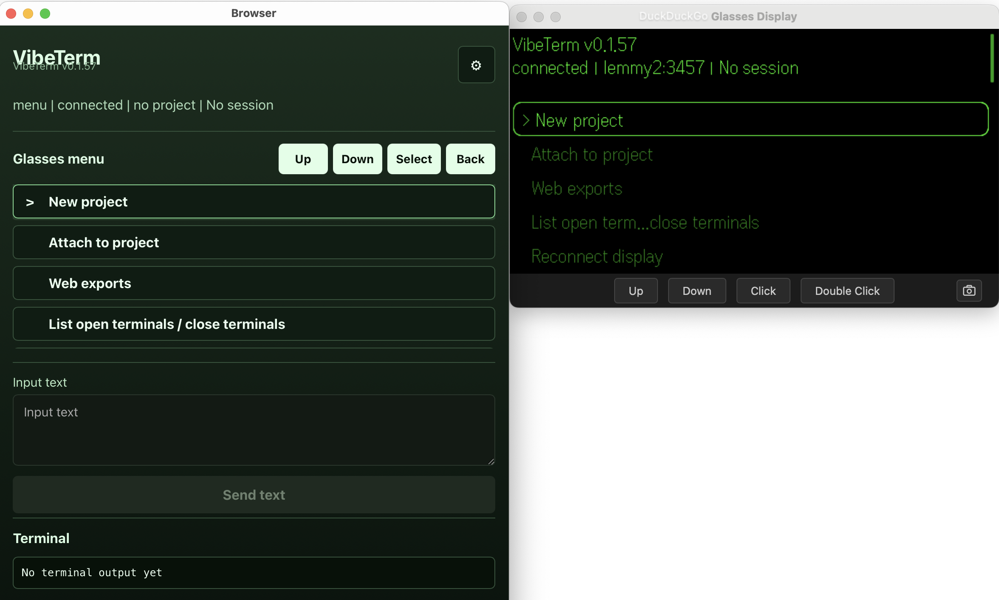
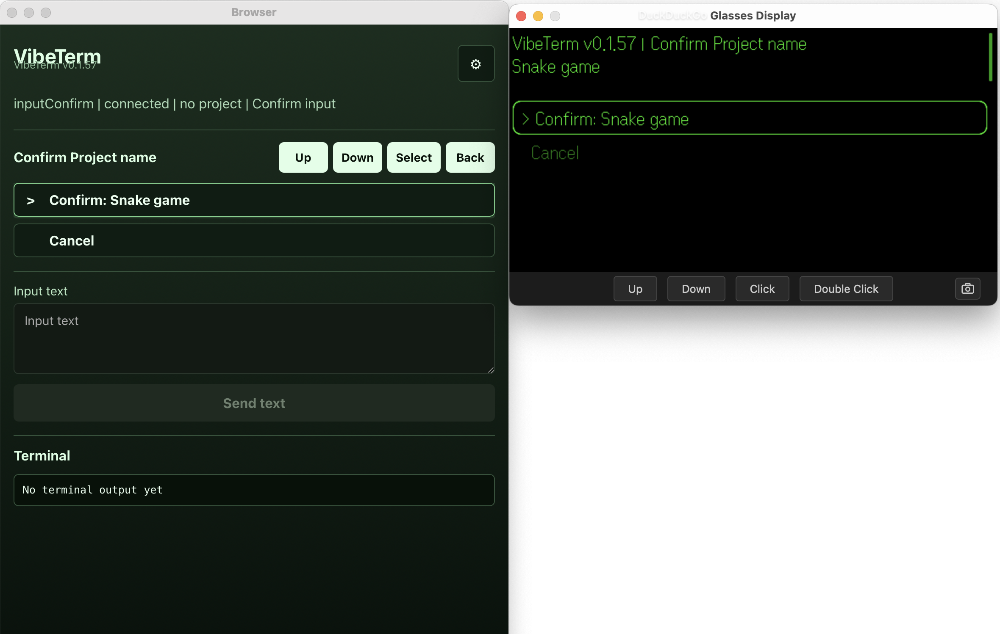
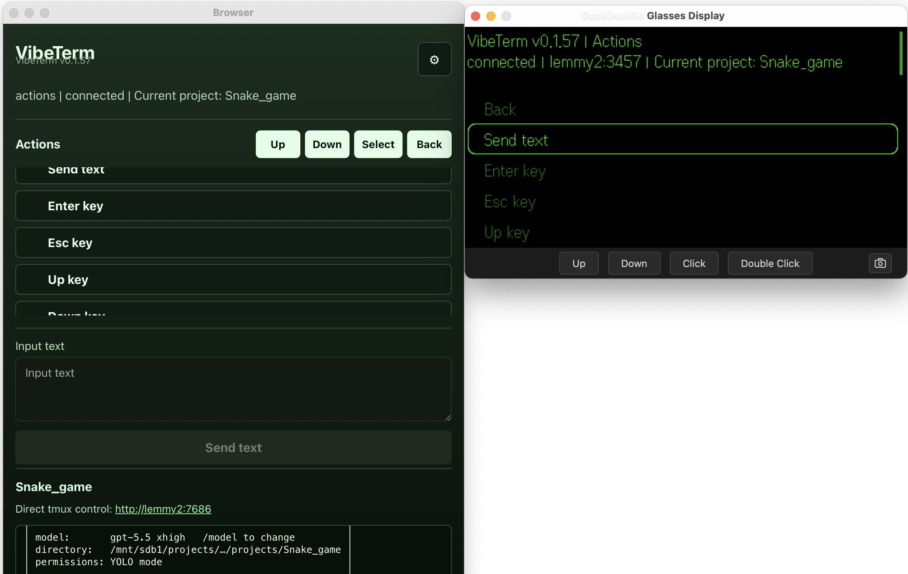
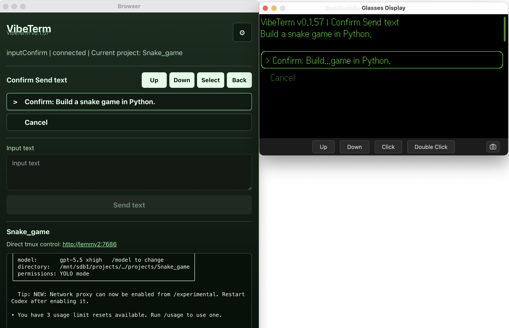
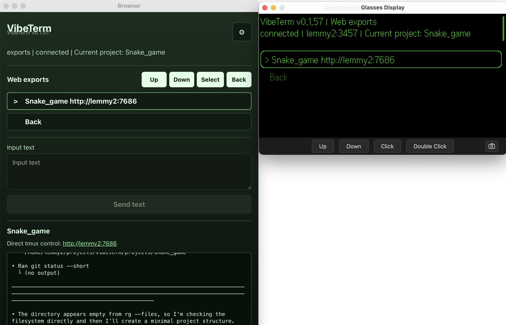
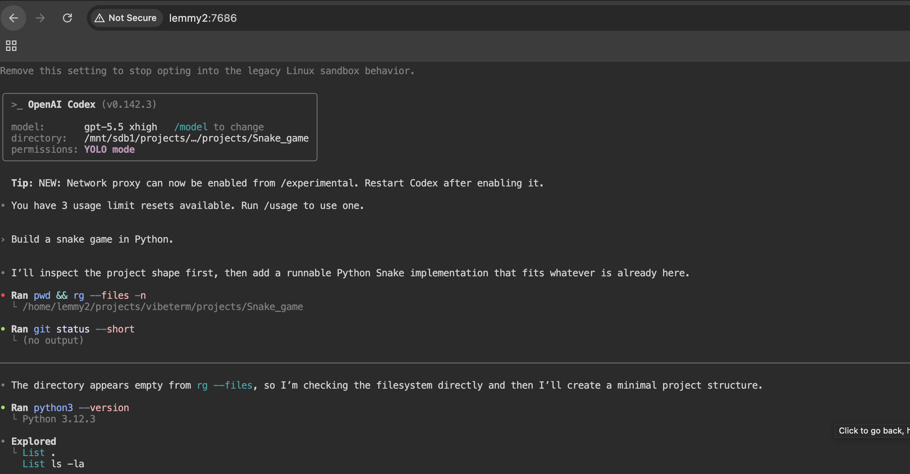
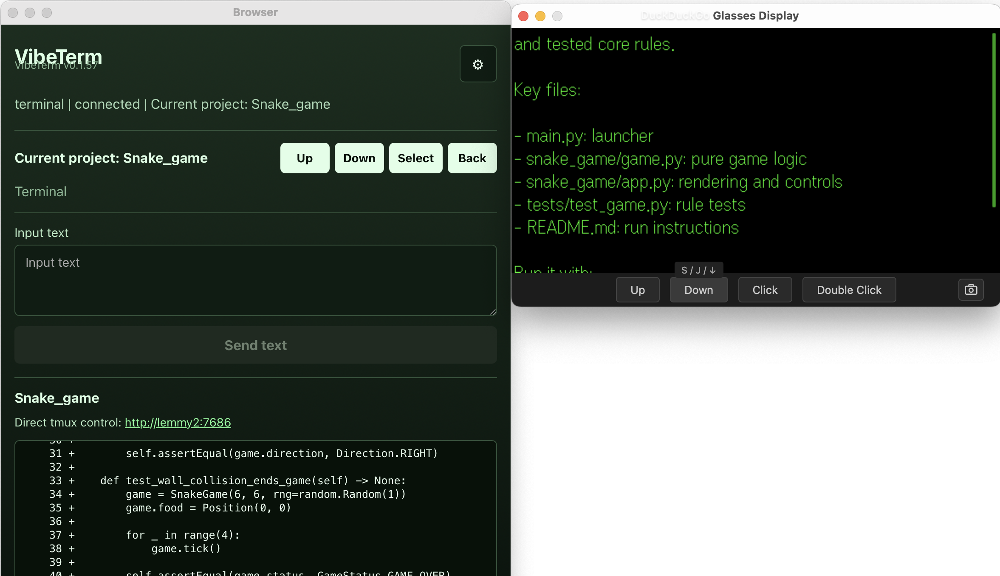

# VibeTerm Server

Public server-side companion for the private VibeTerm Even Hub app.

It runs on your machine, creates project folders, starts prefixed tmux sessions, serves the editable glasses UI config, exposes tmux snapshots/events to the phone app, and optionally transcribes G2 microphone audio.


## Security note
Security is your responsibility. VibeTerm can create folders, start tmux sessions, send text to a shell, stream terminal output, and expose tmux in a browser. Use only on trusted networks, preferably through Tailscale or another private VPN. The traffic is unencrypted per default. Browser tmux exports are powerful and should be treated as a very sensitive remote terminal access.

This is vibe-coded / AI-assisted experimental software. Useful, but not formally audited or hardened. Use at your own risk.

## Setup

```bash
cp .env.example .env.local
npm install
npm run check
npm start
```

Edit `.env.local` before starting:

```bash
VIBETERM_PROJECT_TOKEN=change-me
VIBETERM_PROJECTS_DIR=.projects
VIBETERM_TMUX_SESSION_PREFIX=vibeterm-
VIBETERM_TMUX_EXEC_ROW='git init >/dev/null 2>&1 || true; codex --resume --yolo --enable use_legacy_landlock'
OPENAI_API_KEY=sk-your-key
VIBETERM_STT_OPENAI_MODEL=whisper-1
VIBETERM_TLS=0
```

`VIBETERM_TMUX_EXEC_ROW` is the only command row run inside each new tmux project after the server changes into the project directory. Put any bootstrap work there.

Voice input uses OpenAI Whisper speech-to-text by default. Set `OPENAI_API_KEY` in `.env.local`, and change `VIBETERM_STT_OPENAI_MODEL` if you want a different OpenAI transcription model. To use a local Whisper binary instead, leave `OPENAI_API_KEY` empty and set `VIBETERM_STT_COMMAND`.

VibeTerm treats disk/process state as truth:

- Projects are folders under `VIBETERM_PROJECTS_DIR`.
- Open terminals are running tmux sessions with `VIBETERM_TMUX_SESSION_PREFIX`.
- Web exports are running `ttyd`/`timeout` processes for those tmux sessions.

TLS is off by default because the Even Hub app/WebView may reject local self-signed certificates. Use HTTP over a private LAN/VPN such as Tailscale for the normal setup.

If you have a trusted certificate or trusted reverse proxy/tunnel, set `VIBETERM_TLS=1`. If `VIBETERM_TLS_CERT` and `VIBETERM_TLS_KEY` are missing, the server creates local self-signed certs under `.certs/`, but those dummy certs are not expected to work reliably in the Hub app.

VibeTerm exposes tmux projects in a laptop browser by default with `ttyd` exports from `VIBETERM_TMUX_EXPORT_BASE_PORT` for new/reinitialized projects. Treat plain HTTP exports as very insecure: use only on a trusted LAN/VPN such as Tailscale, or set `VIBETERM_TMUX_AUTO_EXPORT=0` to disable them.

On startup the server prints a setup URL. Set `VIBETERM_PUBLIC_HOST` to the LAN hostname or IP your phone can reach if the detected hostname is not resolvable. Paste the printed URL into VibeTerm Settings -> Load Settings From URL.

## How It Behaves

These screenshots show the phone-side browser panel next to the Even Hub simulator/glasses canvas. The server is doing the local work: creating folders, launching tmux sessions, streaming terminal output, and exposing browser exports.

### 1. Start from the glasses menu

The app starts with no active session. The server status is visible, and the main actions are project creation, attaching to existing tmux sessions, web exports, and terminal cleanup.



### 2. Confirm the project name

When the user speaks or types a new project name, the app asks for confirmation before the server creates a folder and tmux session.



### 3. Use terminal actions

After a project is attached, VibeTerm shows terminal controls for sending text and common keys while the phone view mirrors the tmux output.



### 4. Confirm text before sending

Text headed to the terminal is confirmed before it is sent. This prevents accidental prompts from being injected into the active tmux session.



### 5. Open web exports

The server can expose the current tmux session through a local `ttyd` web export. VibeTerm lists the export URL from the glasses menu.



### 6. Control tmux from a browser

The same exported session can be opened directly in a browser for full tmux control on the laptop.



### 7. Watch live terminal output

As the terminal changes, the server streams snapshots back to VibeTerm so the phone and glasses display stay current.



## Endpoints

- `GET /ui.json` serves `server/vibeterm-ui.json`.
- `GET /setup?token=...` shows runtime settings for the Hub app.
- `GET /setup.json?token=...` returns those settings as JSON.
- `GET /api/info?token=...` returns sidecar status.
- `GET /api/sessions?token=...` lists VibeTerm tmux sessions.
- `POST /api/projects` creates and optionally launches a project.
- `POST /api/projects/reinitialize` recreates the project tmux session.
- `GET /api/events?sessionId=...&token=...` streams tmux snapshots.
- `POST /api/transcribe` accepts `audio/wav` and returns `{ "text": "..." }`.

## Secrets

Do not commit `.env`, `.env.local`, `.projects`, `.logs`, audio files, or real API keys. Those are gitignored here.
